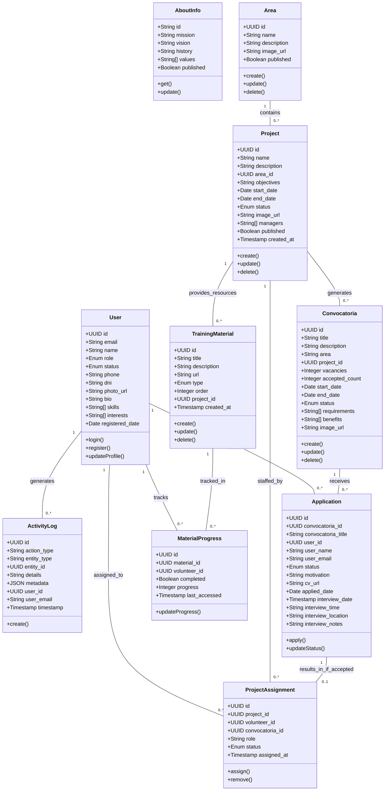

```mermaid
classDiagram
    %% ==========================================
    %% CORE SYSTEM & AUTHENTICATION
    %% ==========================================
    class User {
        +UUID id
        +String email
        +String name
        +Enum role
        +Enum status
        +String phone
        +String dni
        +String photo_url
        +String bio
        +String[] skills
        +String[] interests
        +Date registered_date
        +login()
        +register()
        +updateProfile()
    }

    class ActivityLog {
        +UUID id
        +String action_type
        +String entity_type
        +UUID entity_id
        +String details
        +JSON metadata
        +UUID user_id
        +String user_email
        +Timestamp timestamp
        +create()
    }

    class AboutInfo {
        +String id
        +String mission
        +String vision
        +String history
        +String[] values
        +Boolean published
        +get()
        +update()
    }

    %% ==========================================
    %% ORGANIZATION & PROJECTS
    %% ==========================================
    class Area {
        +UUID id
        +String name
        +String description
        +String image_url
        +Boolean published
        +create()
        +update()
        +delete()
    }

    class Project {
        +UUID id
        +String name
        +String description
        +UUID area_id
        +String objectives
        +Date start_date
        +Date end_date
        +Enum status
        +String image_url
        +String[] managers
        +Boolean published
        +Timestamp created_at
        +create()
        +update()
        +delete()
    }

    %% ==========================================
    %% RECRUITMENT PROCESS
    %% ==========================================
    class Convocatoria {
        +UUID id
        +String title
        +String description
        +String area
        +UUID project_id
        +Integer vacancies
        +Integer accepted_count
        +Date start_date
        +Date end_date
        +Enum status
        +String[] requirements
        +String[] benefits
        +String image_url
        +create()
        +update()
        +delete()
    }

    class Application {
        +UUID id
        +UUID convocatoria_id
        +String convocatoria_title
        +UUID user_id
        +String user_name
        +String user_email
        +Enum status
        +String motivation
        +String cv_url
        +Date applied_date
        +Timestamp interview_date
        +String interview_time
        +String interview_location
        +String interview_notes
        +apply()
        +updateStatus()
    }

    %% Note: Interview conceptual entity mapped to Application fields in current DB implementation
    %% but represented here to show logical separation for future refactoring if desired.
    %% Currently resides inside Application.

    %% ==========================================
    %% OPERATIONS & TRAINING
    %% ==========================================
    class ProjectAssignment {
        +UUID id
        +UUID project_id
        +UUID volunteer_id
        +UUID convocatoria_id
        +String role
        +Enum status
        +Timestamp assigned_at
        +assign()
        +remove()
    }

    class TrainingMaterial {
        +UUID id
        +String title
        +String description
        +String url
        +Enum type
        +Integer order
        +UUID project_id
        +Timestamp created_at
        +create()
        +update()
        +delete()
    }

    class MaterialProgress {
        +UUID id
        +UUID material_id
        +UUID volunteer_id
        +Boolean completed
        +Integer progress
        +Timestamp last_accessed
        +updateProgress()
    }

    %% ==========================================
    %% RELATIONSHIPS
    %% ==========================================

    %% User Relationships
    User "1" -- "0..*" ActivityLog : generates
    User "1" -- "0..*" Application : submits
    User "1" -- "0..*" ProjectAssignment : assigned_to
    User "1" -- "0..*" MaterialProgress : tracks

    %% Organization Hierarchy
    Area "1" -- "0..*" Project : contains
    Project "1" -- "0..*" Convocatoria : generates
    Project "1" -- "0..*" ProjectAssignment : staffed_by
    Project "1" -- "0..*" TrainingMaterial : provides_resources

    %% Process Flow
    Convocatoria "1" -- "0..*" Application : receives
    Application "1" -- "0..1" ProjectAssignment : results_in_if_accepted

    %% Training
    TrainingMaterial "1" -- "0..*" MaterialProgress : tracked_in
```
